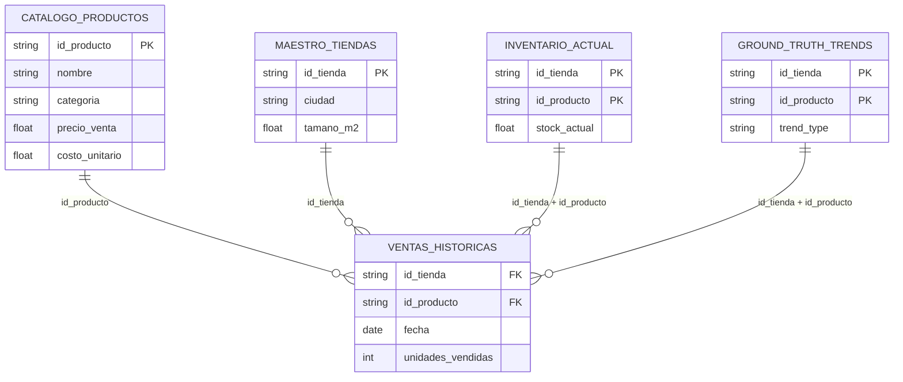

# Caso A — Optimización de Abastecimiento

## Glosario del caso

- **Forecast probabilístico** — pronóstico que estima no solo el valor esperado sino
  la incertidumbre (mediante cuantiles).
- **Cuantiles / pérdida pinball** — el modelo predice percentiles (p10/p50/p90)
  minimizando la pérdida *pinball*; de ahí salen los intervalos de predicción.
- **Newsvendor / *critical fractile*** — modelo de inventario que fija la cantidad de
  pedido óptima balanceando el costo de faltante vs. sobrante; el fractil crítico
  `Cu/(Cu+Co)` es el percentil objetivo del pedido.
- **Holdout temporal / walk-forward** — validación que respeta el tiempo: se entrena
  con el pasado y se evalúa con el futuro (sin fuga de información).
- **WAPE** — error porcentual absoluto ponderado (robusto para demanda).
- **R²** — proporción de la varianza explicada por el modelo.
- **PICP / MPIW** — cobertura de los intervalos (% de valores reales dentro) y su
  anchura media.
- **HPO (Optuna)** — optimización de hiperparámetros.

## Problema de negocio

Predecir la demanda es solo la mitad de la batalla: si se pide de menos se pierden
ventas (costo de oportunidad); si se pide de más, hay costos de almacenamiento y
capital. El objetivo es (1) pronosticar la demanda semanal por SKU-tienda y (2)
decidir la cantidad de pedido que minimiza el costo total esperado, usando la
incertidumbre del modelo y los márgenes del producto.

## Datos, cruces y tabla maestra

**Tabla de hechos (grano base):** `ventas_historicas` — una fila por **fecha ×
tienda × producto** (14.560 filas, sin duplicados en esa llave). Sobre ella se
enganchan, con **LEFT JOIN**, las cuatro dimensiones de `01_supply_optimization`:

| # | Fuente unida | Llave del cruce | Cardinalidad | Aporta | Cobertura |
|---|--------------|-----------------|--------------|--------|-----------|
| 1 | `catalogo_productos` | `id_producto` | N:1 | nombre, categoría, costo, precio, costo de almacenamiento | 100 % |
| 2 | `maestro_tiendas` | `id_tienda` | N:1 | ciudad, tamaño | 100 % |
| 3 | `inventario_actual` | `id_tienda + id_producto` | N:1 | stock actual | 100 % |
| 4 | `ground_truth_trends` | `id_tienda + id_producto` | N:1 | tipo de tendencia | 100 % |

**Cómo se decidió (y por qué así).** Tomé la **tabla de hechos como base** y uní las
dimensiones con **LEFT JOIN**, para que **ninguna venta se pierda** aunque a una
fuente le faltara una fila. Las llaves salen del **grano** de cada dimensión: un
producto es único por `id_producto`, una tienda por `id_tienda`, y tanto el
inventario como la tendencia existen **por par tienda-producto**, por eso su llave es
compuesta. Cada dimensión es **única en su llave** (catálogo 8, tiendas 20, inventario
160 = 20 × 8, tendencias 160), de modo que los cruces son **N:1** (muchos hechos → una
dimensión) y no pueden multiplicar filas.

**Resultado verificado (sin duplicidad, sin cruces vacíos).**

- **Sin duplicidad:** la maestra tiene **14.560 filas = exactamente las del hecho**;
  ningún join multiplicó filas (dimensiones únicas ⇒ cardinalidad N:1).
- **Sin cruces vacíos:** la **cobertura es 100 %** en las cuatro uniones
  (`join_report`): cada venta encontró su producto, su tienda, su inventario y su
  tendencia.
- La maestra diaria se agrega luego a **grano semanal por SKU-tienda** (2.080 filas,
  llave única `tienda + producto + año + semana`), el grano de la decisión de
  reposición.

Código: `cases/masters.py::build_master_a` y `aggregate_weekly_a`. La cobertura se
emite como artefacto (`a_join_report`).

### Diagrama entidad-relación (ERD)



## Features

Reutilizando los transformadores del framework (`framework/features`):

- **Rezagos y media rodante** de la demanda, *group-aware* por SKU-tienda y
  desplazados para no filtrar el valor actual (`GroupLagFeatures`).
- **Estacionalidad cíclica** de la semana en seno/coseno (`CyclicalEncoder`).
- **Codificación de frecuencia** de categoría, ciudad y tendencia
  (`FrequencyEncoder`).
- Atributos de catálogo/tienda/inventario (precio, costo, tamaño, stock).

## Modelos y validación

- **Modelo probabilístico:** gradient boosting cuantílico (pérdida pinball), un
  estimador por cuantil (0.1 / 0.5 / 0.9). Se eligió por dar **intervalos** de
  predicción, necesarios para el optimizador de pedido.
- **Validación de varios modelos:** en el holdout se comparan **Ridge, GBR, el
  cuantílico (mediana) y un ensemble** (`compare_models`). En estos datos, tras el
  feature engineering, Ridge resulta el mejor pronóstico puntual.
- **Partición:** holdout **temporal** (últimas 3 semanas como test); el HPO usa
  **walk-forward** (`TimeSeriesSplit`) para no filtrar el futuro.
- **HPO:** Optuna (TPE) sobre `learning_rate`, `max_depth`, `max_iter`, optimizando
  el WAPE en walk-forward.

## Métricas (lectura, no definición)

- **WAPE** ~12–13 %: error agregado bajo-moderado para demanda semanal; supera al
  baseline ingenuo de persistencia, señal de que el modelo aporta información real.
- **R²** ~0.90: buen ajuste.
- **PICP vs. 80 % nominal:** los intervalos **sub-cubren**, por lo que aún no son
  fiables para fijar niveles de servicio (se recomienda calibración conforme).

## Decisión de pedido (newsvendor)

Con el forecast cuantílico se calcula el fractil crítico `Cu / (Cu + Co)`, con
`Cu = precio − costo` (margen perdido por quiebre) y `Co = almacenamiento`. De ahí
sale el nivel objetivo `S*` y la cantidad a pedir descontando el stock actual
(`framework/optimization/newsvendor.py`). La política óptima reduce ~70 % el costo
esperado de faltante+sobrante frente a pedir lo de la semana previa.

## Cómo ejecutarlo

```bash
uv run kedro run --pipeline caso_a
# o el pipeline programático:  from tostao_ml.cases.caso_a import run_case_a
```

Archivos clave: `cases/caso_a.py`, `pipelines/caso_a/`, `optimization/newsvendor.py`.

## Contexto de ejecución y relación con el proyecto

**Entorno.** El mismo entorno reproducible del proyecto (Python 3.13 + `uv`, ver
[requisitos y stack](../README.md#requisitos-mínimos-y-entorno)); este caso no
requiere extras adicionales.

**Cómo encaja en el flujo (resumen).**

- **Registro.** `src/tostao_ml/pipeline_registry.py` registra este pipeline bajo la
  clave `caso_a` y lo suma al pipeline `__default__` (lo que corre `kedro run`).
- **Pipeline.** `pipelines/caso_a/` encadena dos nodos —`build_master_a` y
  `forecast_and_optimize_a`—; sus entradas y salidas son **nombres del catálogo**
  (`conf/base/catalog*.yml`), no rutas. La salida `a_modelo` persiste el modelo
  entrenado en `data/06_models/modelo_caso_a.pkl`.
- **Lógica.** Los nodos son finos: delegan en `cases/masters.py` (cruces) y en
  `cases/caso_a.py::run_case_a`, que **reutiliza el framework** (`framework/features`,
  `models`, `tuning`, `evaluation`, `interpret`, `optimization`). El framework es
  agnóstico al caso: no conoce a Tostao.
- **Reportes y notebooks.** El completo lo arma `cases/reporting.py` +
  `storytelling.py`; el ejecutivo, `cases/executive.py::executive_a`. En paralelo,
  `notebooks/caso_a/` contiene el EDA (`01_eda`) y el modelamiento desplegado
  (`02_modelamiento`).

**Relación con los otros casos.** Los tres comparten el mismo `framework/` y el mismo
patrón master → modelo → reporte; solo cambian la tabla maestra y el nodo de modelo.
Ver [Caso B](caso_b.md) · [Caso C](caso_c.md) y el [README general](../README.md).
