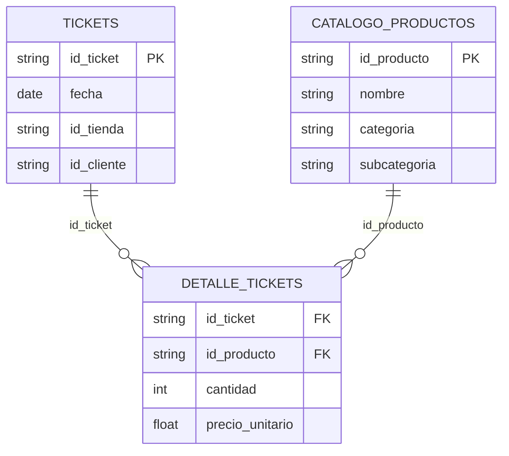

# Caso B — Creación de Combos

## Glosario del caso

- **Clustering (K-Means, Aglomerativo)** — agrupa tiendas por su perfil de compra sin
  etiqueta previa (aprendizaje no supervisado).
- **Silhouette** — métrica de calidad del clustering (−1 a 1): cohesión dentro del
  grupo vs. separación entre grupos.
- **Reglas de asociación (FP-Growth)** — patrones de co-compra «si lleva A, también
  lleva B» extraídos de las cestas.
- **Support / Confidence / Lift / Conviction** — métricas de una regla: frecuencia
  conjunta / probabilidad condicional / cuántas veces más de lo esperado por azar /
  fuerza de la implicación.
- **Grafo de co-compra / centralidad** — red donde los productos son nodos y las
  co-compras aristas; la centralidad identifica los productos «hub» que conectan la
  red.

## Problema de negocio

Se busca incrementar el ticket promedio mediante venta cruzada, identificando
patrones de compra no evidentes. El objetivo es proponer los **Top-5 combos** por
cluster de tiendas, con su precio y el **lift** esperado, filtrando el ruido de
artículos de alta frecuencia y baja correlación específica.

## Datos, cruces y tabla maestra

**Tabla de hechos (grano base):** `detalle_tickets` — una fila por **línea de ticket**
(un producto dentro de un ticket; 18.376 filas). Se enganchan con **LEFT JOIN** las
dos fuentes de `02_product_bundles`:

| # | Fuente unida | Llave del cruce | Cardinalidad | Aporta | Cobertura |
|---|--------------|-----------------|--------------|--------|-----------|
| 1 | `tickets` (cabecera) | `id_ticket` | N:1 | fecha, tienda, cliente | 100 % |
| 2 | `catalogo_productos` | `id_producto` | N:1 | nombre, categoría, subcategoría | 100 % |

**Cómo se decidió (y por qué así).** El **detalle** (las líneas de venta) es el hecho;
a cada línea le pego su **cabecera** (para saber cuándo, dónde y quién) por `id_ticket`
y el **catálogo** (para saber qué es el producto) por `id_producto`. Ambas son
dimensiones **únicas en su llave** (10.000 tickets, 35 productos), así que los cruces
son **N:1** y no multiplican líneas. Uso LEFT JOIN para no perder ninguna línea de
venta.

**Resultado verificado (sin duplicidad, sin cruces vacíos).**

- **Sin duplicidad:** la maestra tiene **18.376 filas = exactamente las del detalle**.
- **Sin cruces vacíos:** **cobertura 100 %** en ambas uniones (cada línea tiene su
  cabecera y su producto).
- De la maestra se arma la **matriz de cestas** `ticket × producto` (10.000 × 35,
  booleana, índice único por ticket), insumo del FP-Growth.

Código: `cases/masters.py::build_master_b` y `build_baskets_b`.

### Diagrama entidad-relación (ERD)



## Modelos y validación (dos enfoques complementarios)

1. **Segmentación de tiendas.** Se construye un perfil de compra por tienda (mezcla
   de categorías + estadísticos de cesta) y se agrupa con **K-Means**. Se **compara
   K-Means vs. Aglomerativo** por *silhouette* y se elige el mejor; además se hace
   un barrido para seleccionar `k` (no a dedo).
2. **Reglas de asociación.** Con **FP-Growth** se extraen reglas de co-compra por
   cluster (support / confidence / lift / conviction), filtrando por `lift > 1` y un
   soporte mínimo para descartar ruido.
3. **Grafo de co-compra (complementario).** Se modela un grafo (networkx) donde los
   nodos son productos y las aristas su co-ocurrencia; la **centralidad** revela los
   productos «hub» que conectan la red, una vista alternativa a las reglas.

No hay partición train/test porque es aprendizaje **no supervisado**: se usa todo
el histórico de cestas.

## Métricas (lectura, no definición)

- **Silhouette** ~0.32: estructura moderada pero clara; los segmentos son
  separables. La `k` está justificada por los datos, no elegida a mano.
- **Lift** de los combos entre 5 y 9: se compran juntos varias veces más de lo
  esperado por azar, señal robusta (con soporte suficiente, no coincidencia).

## Decisión de negocio

Por cada cluster se eligen los combos de mayor lift y se propone un precio con
descuento configurable. El lift esperado prioriza qué combos activar por segmento.

## Cómo ejecutarlo

```bash
uv run kedro run --pipeline caso_b
# o:  from tostao_ml.cases.caso_b import run_case_b
```

Archivos clave: `cases/caso_b.py` (perfiles, clustering, reglas, grafo, combos),
`pipelines/caso_b/`.

## Contexto de ejecución y relación con el proyecto

**Entorno.** El mismo entorno del proyecto (Python 3.13 + `uv`) **más el extra
`caso_b`** para las reglas de asociación y el grafo:
`uv sync --extra caso_b` (instala `mlxtend`, `efficient-apriori`, `networkx`). Ver
[requisitos y stack](../README.md#requisitos-mínimos-y-entorno).

**Cómo encaja en el flujo (resumen).**

- **Registro.** `pipeline_registry.py` registra este pipeline como `caso_b` y lo
  añade al `__default__`.
- **Pipeline.** `pipelines/caso_b/` encadena `build_master_b` (cruce + matriz de
  cestas) y el nodo de segmentación/combos; entradas y salidas son nombres del
  catálogo (`conf/base/catalog*.yml`).
- **Lógica.** Los nodos delegan en `cases/masters.py` y en
  `cases/caso_b.py::run_case_b`, que **reutiliza el framework** (`models` para
  K-Means, `viz`, `narrate`) y añade lo específico del caso (FP-Growth, grafo). Al
  ser no supervisado no hay artefacto de modelo persistido: la salida son las reglas
  y los combos.
- **Reportes y notebooks.** Completo en `cases/reporting.py`; ejecutivo en
  `cases/executive.py::executive_b`; exploración en `notebooks/caso_b/`.

**Relación con los otros casos.** Comparte framework y patrón master → modelo →
reporte con los demás. Ver [Caso A](caso_a.md) · [Caso C](caso_c.md) y el
[README general](../README.md).
