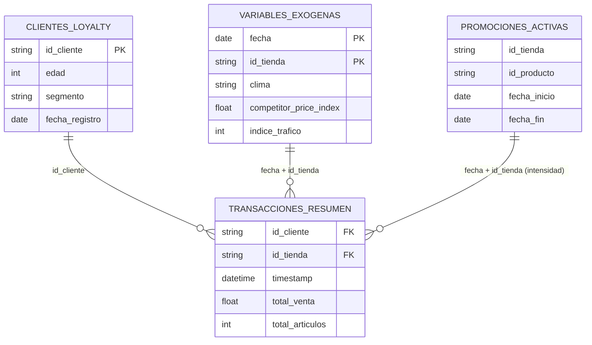

# Caso C — Modelado del Ticket Promedio (AOV)

## Glosario del caso

- **AOV** — *Average Order Value*, el ticket promedio.
- **GLM (inferencial)** — modelo lineal generalizado que estima el efecto de cada
  *driver* sobre el ticket, con significancia estadística.
- **Coeficiente β / p-valor / IC95%** — magnitud del efecto / probabilidad de que sea
  azar (significativo si p<0.05) / intervalo de confianza (si no cruza cero, el efecto
  es real).
- **Winsorización** — recorte de los valores extremos (*outliers*) antes de ajustar.
- **RFM** — *Recency, Frequency, Monetary*: features del comportamiento del cliente.
- **Holdout 80/20** — 80 % de los datos para entrenar y 20 % para evaluar.
- **SHAP** — contribución de cada feature a la predicción del gasto.
- **WAPE / MAE / R²** — métricas de error y de ajuste del modelo predictivo.

## Problema de negocio

Existe alta variabilidad en el ticket promedio (AOV) entre sucursales. Se necesita
(1) entender qué factores exógenos y endógenos lo influyen (modelo **inferencial**)
y (2) estimar el **gasto esperado** de un cliente recurrente en su próxima visita
(modelo **predictivo**), con interpretabilidad y manejo de outliers.

## Datos, cruces y tabla maestra

**Tabla de hechos (grano base):** `transacciones_resumen` — una fila por **ticket**
(10.000 filas). Se enganchan con **LEFT JOIN** tres fuentes de `03_aov_drivers`:

| # | Fuente unida | Llave del cruce | Cardinalidad | Aporta | Cobertura |
|---|--------------|-----------------|--------------|--------|-----------|
| 1 | `clientes_loyalty` | `id_cliente` | N:1 | edad, segmento, antigüedad | 100 % |
| 2 | `variables_exogenas` | `fecha + id_tienda` | N:1 | clima, competencia, tráfico | 100 % |
| 3 | `promociones_activas` (→ intensidad) | `fecha + id_tienda` | N:1 | nº de promos activas | 98.4 %* |

\*Cobertura de promo = **% de tickets con al menos una promo activa**; 0 promos es un
valor válido, no un cruce roto (ver abajo).

**Cómo se decidió (y por qué así).**

- El **ticket** es el hecho. Le pego el **perfil del cliente** por `id_cliente` (1.000
  clientes únicos) y las **condiciones exógenas** del día y la tienda por `fecha +
  id_tienda` (910 combinaciones únicas). Ambas son N:1.
- Las **promociones** son distintas: no son un hecho por día, sino **rangos de fecha**
  (`fecha_inicio`–`fecha_fin`) por tienda/producto. Unirlas directo sería un cruce por
  rango (**many-to-many**) que **duplicaría** tickets. Por eso primero las **expando a
  días** y las **cuento por `(fecha, id_tienda)`** en una tabla de **intensidad**
  (`n_promos_activas`, 894 combinaciones únicas derivadas de 493 promos). Esa tabla ya
  es N:1 y se une limpio; los tickets sin promo reciben **0** (no NULL).

**Resultado verificado (sin duplicidad, sin cruces vacíos).**

- **Sin duplicidad:** la maestra tiene **10.000 filas = exactamente los tickets**; ni
  siquiera la promo (gracias a su pre-agregación a intensidad) multiplicó filas.
- **Sin cruces vacíos en las uniones de integridad:** `clientes_loyalty` y
  `variables_exogenas` cubren **100 %**. La promo cubre **98.4 %**, pero eso **no es un
  cruce vacío**: es la **penetración** de promociones (el 1.6 % restante son tickets
  sin promo, que legítimamente valen 0).

Código: `cases/masters.py::build_master_c` y `_promo_intensity`.

### Diagrama entidad-relación (ERD)



> `promociones_activas` se expande a días y se cuenta por `(fecha, id_tienda)` (→
> `n_promos_activas`) **antes** de unirse, para no duplicar tickets.

## Modelos y validación

1. **Inferencial — GLM gaussiano.** Coeficientes con error estándar, p-valor e
   intervalo de confianza; outliers **winsorizados** antes de ajustar. Responde qué
   drivers mueven el ticket y en qué dirección, con significancia estadística.
2. **Predictivo — gasto del cliente recurrente.** Features RFM + loyalty por cliente
   (recencia, frecuencia, edad, antigüedad, segmento). Se **comparan Ridge / GBR /
   ensemble** en un holdout **80/20** (`compare_models`) y se optimiza con **Optuna
   (K-Fold)**. En estos datos Ridge resulta el mejor.

El GLM se ajusta sobre todo el conjunto (su fin es inferencial, no predecir); el
modelo de gasto usa el holdout para medir generalización frente al baseline de la
media.

## Métricas (lectura, no definición)

- **GLM:** `total_articulos` es el driver dominante y altamente significativo
  (β~8, p<0.001; el IC no cruza cero); el clima lluvioso reduce el ticket de forma
  significativa aunque con efecto pequeño; el resto no es significativo.
- **Predictivo:** R² ~0.81 (ajuste fuerte) y mejora el baseline de la media en WAPE,
  confirmando que el perfil RFM+loyalty predice el gasto; el MAE es bajo frente al
  ticket medio.

## Decisión de negocio

Los drivers significativos orientan acciones (p. ej. mitigar el efecto del clima);
el modelo de gasto prioriza clientes por valor esperado para campañas.

## Cómo ejecutarlo

```bash
uv run kedro run --pipeline caso_c
# o:  from tostao_ml.cases.caso_c import run_case_c
```

Archivos clave: `cases/caso_c.py` (GLM inferencial + predictivo + comparación),
`pipelines/caso_c/`, `models/linear.py` (GLM), `interpret/` (SHAP).

## Contexto de ejecución y relación con el proyecto

**Entorno.** El mismo entorno reproducible del proyecto (Python 3.13 + `uv`, ver
[requisitos y stack](../README.md#requisitos-mínimos-y-entorno)); no requiere extras
adicionales.

**Cómo encaja en el flujo (resumen).**

- **Registro.** `pipeline_registry.py` registra este pipeline como `caso_c` y lo
  añade al `__default__`.
- **Pipeline.** `pipelines/caso_c/` encadena `build_master_c` y `aov_models_c`;
  entradas y salidas son nombres del catálogo. La salida `c_modelo` persiste el
  modelo **predictivo** de gasto en `data/06_models/modelo_caso_c.pkl` (el GLM es
  inferencial y no se persiste como artefacto de scoring).
- **Lógica.** Los nodos delegan en `cases/masters.py` y en
  `cases/caso_c.py::run_case_c`, que **reutiliza el framework** (`models/linear.py`
  para el GLM, `tuning` para Optuna, `evaluation` para las métricas, `interpret`
  para SHAP).
- **Reportes y notebooks.** Completo en `cases/reporting.py`; ejecutivo en
  `cases/executive.py::executive_c`; exploración en `notebooks/caso_c/`.

**Relación con los otros casos.** Comparte framework y patrón master → modelo →
reporte con los demás. Ver [Caso A](caso_a.md) · [Caso B](caso_b.md) y el
[README general](../README.md).
